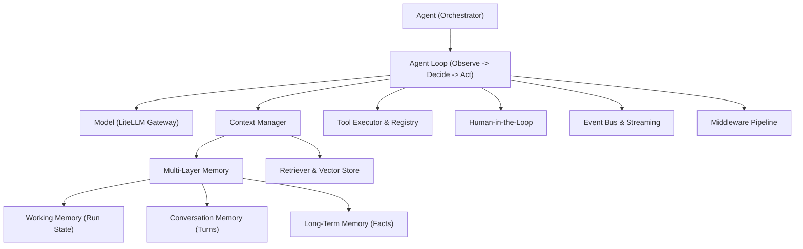

# LiteLLM ADK (Agent Development Kit)

> A modular, production-ready Python Agent Framework built on top of LiteLLM.

## Overview

The **LiteLLM Agent Development Kit (ADK)** provides a provider-agnostic, model-agnostic, and storage-agnostic architecture for building, scaling, and observing autonomous LLM applications. 

By acting as an orchestration layer on top of `litellm`, the ADK enables engineering teams to create configurable AI agents without rebuilding the core execution loop, multi-tier memory, tool execution pipelines, vector search, or human-in-the-loop workflows for every project.

---

## Architectural Design

Following the principle:
> *"The Agent orchestrates. Components specialize. Interfaces enable replacement. LiteLLM handles model-provider abstraction."*



---

## Installation

```bash
pip install litellm-adk
```

Optional dependencies:
```bash
pip install litellm-adk[telemetry]  # OpenTelemetry instrumentation
pip install litellm-adk[embeddings] # Local embeddings
```

---

## Quick Start

Creating an autonomous agent requires only standard configurations:

```python
import asyncio
from litellm_adk import Agent, tool

@tool
async def get_weather(city: str) -> str:
    """Fetches current weather for a city."""
    return f"Weather in {city}: Sunny, 24°C"

async def main():
    agent = Agent(
        name="weather_assistant",
        model="openai/gpt-4o",
        system_prompt="You are a helpful travel assistant.",
        tools=[get_weather],
    )

    result = await agent.run("What's the weather in Tokyo?")
    print(result.text)

if __name__ == "__main__":
    asyncio.run(main())
```

---

## Core Capabilities

### 1. First-Class Tool System
Tools are declared using the `@tool` decorator, which automatically parses parameter types, defaults, and docstrings into OpenAPI-compliant JSON schemas with permission safety gates:

```python
from litellm_adk import tool, ToolPermission

@tool(
    name="query_database",
    description="Executes a read-only database query.",
    permissions={ToolPermission.READ},
    timeout=10.0,
)
def query_db(sql: str) -> str:
    return "Query results..."
```

### 2. Human-in-the-Loop (HITL)
Flag sensitive actions as requiring approval to pause the agent loop and request authorization via console, API, or custom callbacks:

```python
from litellm_adk import Agent, tool, ConsoleHumanLoop

@tool(requires_approval=True)
async def process_refund(order_id: str, amount: float) -> str:
    return f"Refunded ${amount} for order {order_id}."

agent = Agent(
    model="openai/gpt-4o",
    tools=[process_refund],
    human_in_the_loop=ConsoleHumanLoop(),
)
```

### 3. Multi-Layer Memory Architecture
Separate execution state across three distinct layers:
- **Working Memory**: Temporary scratchpad (current task, plan, and intermediate variables) for the ongoing turn.
- **Conversation Memory**: Conversational turn history (user, assistant, tool calls).
- **Long-Term Memory**: Persistent facts, preferences, and knowledge surviving across sessions.

```python
from litellm_adk import Agent, LongTermMemory

memory = LongTermMemory()
await memory.add_fact("user_style", "Prefers concise, point-form answers.")

agent = Agent(
    model="openai/gpt-4o",
    system_prompt="You are an assistant.",
)
```

### 4. Vector Store & RAG
Zero-dependency in-memory vector store and retrieval pipeline out of the box:

```python
from litellm_adk import Agent, InMemoryVectorStore, Retriever

vector_store = InMemoryVectorStore()
retriever = Retriever(vector_store=vector_store)

# Index reference documents
await retriever.add_documents([
    "Company policy: All international travel requires VP sign-off.",
    "Expense limit for business meals is $75 per person."
])

agent = Agent(
    model="openai/gpt-4o",
    retriever=retriever,
)
```

### 5. Structured Outputs with Self-Repair
Enforce Pydantic response models. If LLM output fails schema validation, the agent automatically generates a targeted repair prompt to correct the format:

```python
from pydantic import BaseModel
from litellm_adk import Agent

class ExtractedContact(BaseModel):
    name: str
    email: str
    company: str

agent = Agent(model="openai/gpt-4o")

result = await agent.run(
    "Please extract: John Doe, engineer at Acme Corp (john@acme.com)",
    response_model=ExtractedContact,
)

contact: ExtractedContact = result.structured
print(f"Parsed contact: {contact.name} <{contact.email}>")
```

### 6. Event Streaming
Subscribe to fine-grained lifecycle events or stream deltas directly:

```python
agent = Agent(model="openai/gpt-4o")

agent.on("tool.started", lambda ev: print(f"🔧 Starting tool: {ev.tool_name}"))
agent.on("tool.completed", lambda ev: print(f"✅ Finished tool: {ev.tool_name}"))

async for event in agent.stream("Research latest breakthroughs in fusion energy."):
    if event.type == "text.delta":
        print(event.delta, end="", flush=True)
```

### 7. Multi-Agent Systems
Wrap any Agent as a callable Tool for supervisor agents:

```python
from litellm_adk import Agent, Supervisor, agent_as_tool

researcher = Agent(name="Researcher", model="openai/gpt-4o", description="Researches topics.")
coder = Agent(name="Coder", model="openai/gpt-4o", description="Writes Python code.")

supervisor = Supervisor(
    agents=[researcher, coder],
    model="openai/gpt-4o",
)

result = await supervisor.run("Research quicksort algorithm and implement it.")
```

---

## Package Architecture

```text
src/litellm_adk/
├── agent/            # Agent orchestrator, loop, config, state, result, output parser
├── models/           # LiteLLM gateway, Model protocol, ModelConfig
├── tools/            # First-class Tool abstraction, registry, executor, permissions
├── memory/           # Working, Conversation, Long-term memory, MemoryPolicy
├── vector/           # VectorStore, Embedder, Retriever (RAG)
├── context/          # ContextManager, token budgeting, ContextPolicy
├── human/            # ConsoleHumanLoop, CallbackHumanLoop, ApprovalManager
├── events/           # EventBus, typed lifecycle events, streaming
├── middleware/       # Middleware pipeline, LoggingMiddleware, PIIScrubbing
├── persistence/      # SessionStore, RunStore
├── multiagent/       # AgentTool, AgentTeam, Supervisor
├── observability/    # Telemetry, metrics, token and cost tracking
└── exceptions.py     # Explicit framework exception hierarchy
```

---

## Backward Compatibility

Existing applications using `LiteLLMAgent` and `ainvoke()` / `invoke()` continue to work without modification:

```python
from litellm_adk import LiteLLMAgent

agent = LiteLLMAgent(model="openai/gpt-4o")
response = await agent.ainvoke("Hello!")
print(response.content)
```

---

## License
MIT License.
