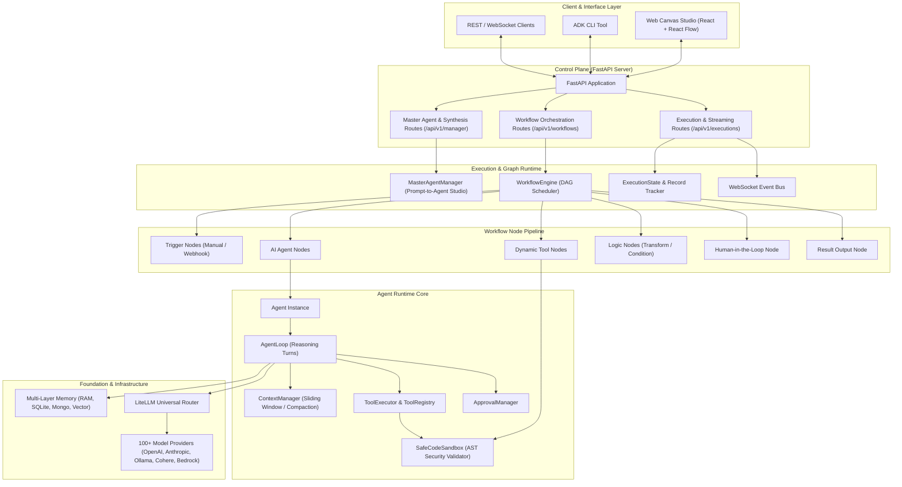

# Architecture Overview

The **LiteLLM ADK** (Agent Development Kit) is an enterprise-grade agentic operating framework built on top of [LiteLLM](https://github.com/BerriAI/litellm). It decouples autonomous agent reasoning, dynamic tool creation, and graph workflow orchestration from proprietary vendor APIs, providing unified abstractions for building multi-turn, multi-agent AI systems.

---

## 1. High-Level System Topology

---

## 2. Core Architectural Principles

### 1. Vendor Agnostic Abstraction
All LLM communication flows through the `LiteLLMModel` interface. Whether running local open-weights models through Ollama/vLLM, or enterprise frontier models via OpenAI, Anthropic, Cohere, or AWS Bedrock, agent definitions remain 100% identical.

### 2. Separation of Declarative Spec vs Runtime Instance
- **Declarative Specs**: Workflows and Agents are serializable JSON structures (`WorkflowDefinition`, `WorkflowNode`, `AgentConfig`, `DynamicToolSpec`). They can be stored in SQLite, exported to JSON, or visually manipulated on the React canvas.
- **Runtime Instances**: During execution, specifications compile into executable actors (`WorkflowEngine`, `Agent`, `Tool`), maintaining full state isolation and non-blocking asynchronous execution.

### 3. Strict AST Security Sandboxing for Dynamic Tools
User-prompted or LLM-generated code cannot execute directly in the host process without validation. The `ASTSecurityValidator` inspects the Abstract Syntax Tree for prohibited modules (`os`, `sys`, `subprocess`, `socket`) and restricted primitives (`eval`, `exec`, dunder introspection). Code only executes within the restricted `SafeCodeSandbox`.

### 4. Non-Blocking Human-in-the-Loop Intercepts
When an agent or tool requires authorization (e.g. database mutations, payments, external emails), the runtime transitions to `WAITING_FOR_HUMAN`. Execution state is persisted in SQLite, allowing human operators to review, approve, reject, or provide feedback before the workflow resumes.

---

## 3. Data Flow in an Execution Run

```mermaid
sequenceDiagram
    autonumber
    participant UI as Canvas Studio / Client
    participant API as FastAPI Control Plane
    participant Engine as WorkflowEngine
    participant Agent as AgentNode & AgentLoop
    participant Sandbox as SafeCodeSandbox
    participant LLM as LiteLLM Router / Model Provider

    UI->>API: POST /api/v1/workflows/{id}/execute
    API->>Engine: execute(workflow, trigger_data)
    Engine->>UI: Broadcast event: workflow.started
    
    rect rgb(30, 41, 59)
        note over Engine,Agent: Topological Batch Execution
        Engine->>Engine: Execute Manual Trigger -> Emits payload
        Engine->>Sandbox: Execute DynamicToolNode -> Validates & registers tool
        Engine->>Agent: Execute AgentNode with inputs & tool socket
    end

    Agent->>LLM: ainvoke(prompt, tools)
    alt LLM requests tool call
        LLM-->>Agent: tool_calls: [generate_greeting(user_name='Alice')]
        Agent->>Sandbox: SafeCodeSandbox.execute(code, arguments)
        Sandbox-->>Agent: Result: {'status': 'success', 'message': '...'}
        Agent->>LLM: Send tool result back to model
        LLM-->>Agent: Final response text
    else Offline or test run fallback
        Agent->>Sandbox: Execute attached tool with rendered trigger inputs
        Sandbox-->>Agent: Simulated tool response
    end

    Agent-->>Engine: NodeResult(COMPLETED, output)
    Engine->>UI: Broadcast event: node.completed
    Engine->>UI: Broadcast event: workflow.completed
```

---

## 4. Subsystem Breakdown

| Subsystem | Package Path | Primary Responsibilities |
|---|---|---|
| **Agent Engine** | `src/litellm_adk/agent/` | Multi-turn reasoning loop, lifecycle management, tool call orchestration, and execution configurations. |
| **Tools & Dynamic Tooling** | `src/litellm_adk/tools/` | Tool abstractions, AST security validation, restricted sandbox execution, OpenAPI schema generation, and MCP protocols. |
| **Master Agent & Studio** | `src/litellm_adk/agent/manager.py` | Prompt-to-Agent autonomous compiler, domain tool inference, and canvas graph wiring. |
| **Workflow Runtime** | `src/litellm_adk/workflow/` | DAG topological sort, concurrent node scheduling, expression evaluation, and event bus broadcasting. |
| **Memory & Context** | `src/litellm_adk/memory/`, `src/litellm_adk/context/` | Ephemeral, SQLite, MongoDB memory stores, token window management, and compaction strategies. |
| **Safety & Approvals** | `src/litellm_adk/approval/`, `src/litellm_adk/human/` | Human-in-the-loop decision gating, pending approval storage, and resumption handlers. |
| **Multi-Agent** | `src/litellm_adk/multiagent/` | Hierarchical supervisor networks, agent teams, and bidirectional delegation handoffs. |
| **Server & Control Plane** | `src/litellm_adk/server/` | REST API routes, WebSocket live streaming, SQLite persistence, and static UI delivery. |
