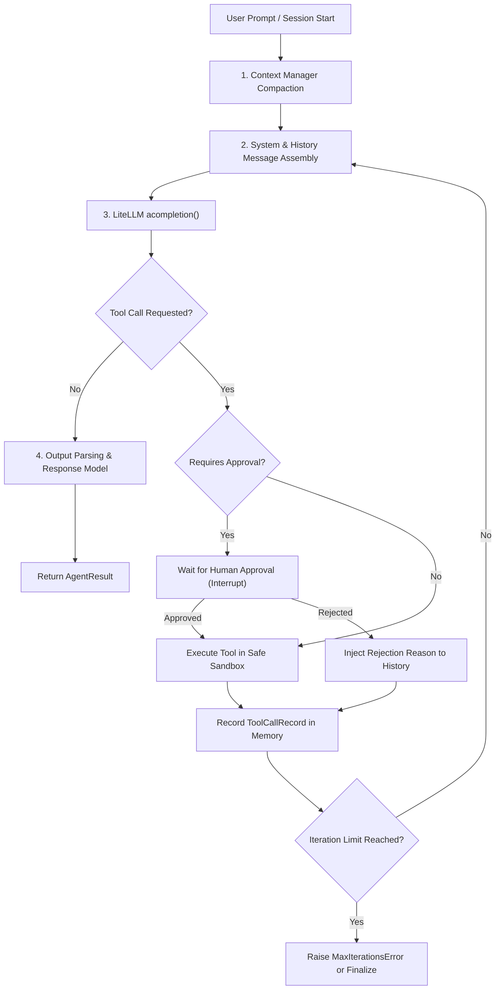
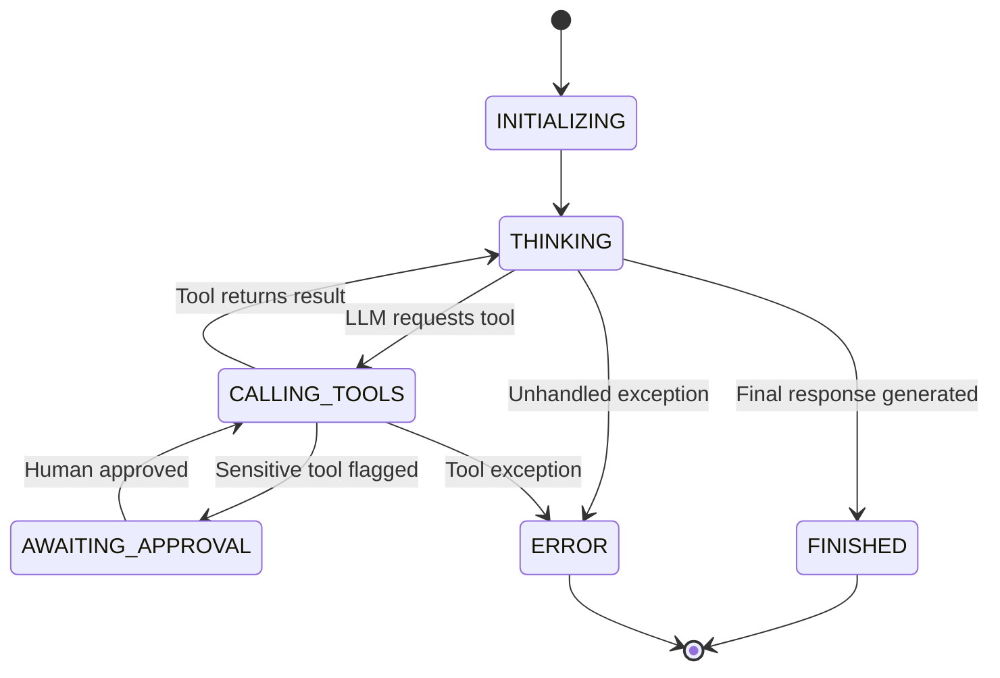

# Agent Framework & Core Reasoning Loop

The **Agent Core** (`src/litellm_adk/agent/`) is the central cognitive engine of the ADK. It manages multi-turn tool-calling loops, context window compaction, lifecycle events, and structured schema extraction.

---

## 1. The `Agent` Class

The `Agent` class provides a unified interface for defining autonomous AI agents.

```python
from litellm_adk import Agent, ExecutionConfig
from litellm_adk.models import ModelConfig

agent = Agent(
    name="CustomerSupportSpecialist",
    description="Resolves tier-1 customer inquiries and order issues.",
    model="gpt-4o",  # String identifier or ModelConfig instance
    system_prompt="You are an empathetic, efficient customer support specialist.",
    tools=[lookup_order, cancel_order, escalate_ticket],
    execution_config=ExecutionConfig(
        max_iterations=8,           # Stop after 8 reasoning turns
        max_execution_time=60.0,    # Max total wall-clock time in seconds
    ),
    scrub_pii=True,                # Mask emails/credit cards in telemetry
)
```

### Key Constructor Parameters

| Parameter | Type | Default | Description |
|---|---|---|---|
| `name` | `str` | `"Assistant"` | Unique identifying name for logging and multi-agent addressing. |
| `description` | `str` | `""` | Description of capabilities (used when an agent is wrapped as a tool). |
| `model` | `str \| ModelConfig` | `"gpt-4o"` | Model identifier supported by LiteLLM. |
| `api_key` | `Optional[str]` | `None` | Provider API key (falls back to environment variables). |
| `base_url` | `Optional[str]` | `None` | Custom proxy or local endpoint (e.g. `http://localhost:9000/v1`). |
| `system_prompt` | `str \| Callable` | `"You are a helpful assistant."` | Core persona and operational instructions. |
| `tools` | `List[Any]` | `[]` | Tools passed as functions, `Tool` objects, or dynamic tool dicts. |
| `memory` | `Optional[BaseMemory]` | `None` | Multi-turn memory backend (defaults to `InMemoryMemory`). |
| `approval_manager` | `Optional[Any]` | `None` | Interceptor for human authorization on sensitive tool calls. |
| `execution_config` | `Optional[ExecutionConfig]` | `None` | Loop constraints (iteration and time limits). |
| `response_model` | `Optional[Type[BaseModel]]` | `None` | Pydantic model for guaranteed structured output. |

---

## 2. The Internal Reasoning Cycle (`AgentLoop`)

When `agent.ainvoke()` or `agent.astream()` is called, control is handed to `AgentLoop`.



### Turn Lifecycle Steps:
1. **Context Prep**: Retrieves relevant conversation history and compacts messages if context exceeds the token budget.
2. **Model Call**: Dispatches prompt and active OpenAPI tool definitions to LiteLLM.
3. **Tool Execution**:
   - If the model returns `tool_calls`, arguments are parsed and validated against the tool's schema.
   - If the tool requires approval, the loop halts and yields a `requires_approval` status.
   - The tool executes (in native Python or `SafeCodeSandbox`), and output is formatted as a `tool` role message.
4. **Recurse / Finish**: Loops back to the model with tool results until the model responds with final text or iteration limits are reached.

---

## 3. Agent Lifecycle States

The agent tracks execution state through `AgentLifecycleState`:



---

## 4. Structured Output with Pydantic

Enforce typed JSON schemas using the `response_model` argument:

```python
from pydantic import BaseModel, Field
from litellm_adk import Agent

class RiskAssessment(BaseModel):
    risk_level: str = Field(description="Low, Medium, or High")
    score: float = Field(ge=0.0, le=100.0, description="Numerical risk rating")
    flags: list[str] = Field(default_factory=list, description="Specific risk indicators")
    recommendation: str = Field(description="Actionable mitigation advice")

agent = Agent(
    model="gpt-4o",
    system_prompt="Analyze transactional data and generate a structured risk assessment.",
    response_model=RiskAssessment,
)

result = await agent.ainvoke("User transferred $45,000 from an unverified IP in Lithuania.")
# result.structured contains a validated instance of RiskAssessment
assessment: RiskAssessment = result.structured
print(f"Risk: {assessment.risk_level} ({assessment.score}/100)")
print("Mitigation:", assessment.recommendation)
```

---

## 5. Streaming Responses (`astream`)

For interactive chatbots and real-time streaming:

```python
async for chunk in agent.astream("Draft a technical summary of distributed vector databases."):
    if chunk.text:
        print(chunk.text, end="", flush=True)
    elif chunk.tool_call:
        print(f"\n[Calling tool: {chunk.tool_call.name}...]")
```
