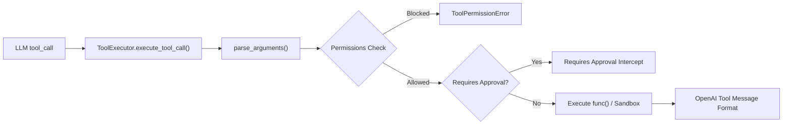

# Tools & Dynamic Tooling Architecture

The LiteLLM ADK tool execution framework (`src/litellm_adk/tools/`) provides a secure, typed, and permission-controlled mechanism for agents to invoke functions, external APIs, MCP servers, and LLM-synthesized dynamic Python code.

---

## 1. Native Tool Definition

Tools can be defined using standard Python functions decorated with `@tool`. The decorator automatically parses type annotations, derives an OpenAPI function-calling schema, and registers the tool into `tool_registry`.

```python
from litellm_adk.tools import tool, ToolPermission

@tool(
    name="query_inventory_db",
    description="Retrieves live stock count for a warehouse SKU.",
    permissions={ToolPermission.READ},
    timeout=5.0,
    requires_approval=False,
)
def query_inventory(sku: str, warehouse_id: str = "US-EAST-1") -> dict:
    # Business logic here
    return {
        "sku": sku,
        "warehouse": warehouse_id,
        "quantity_available": 142,
        "status": "in_stock",
    }
```

### Decorator Options

| Argument | Type | Default | Description |
|---|---|---|---|
| `name` | `Optional[str]` | `func.__name__` | Identifier exposed to LLM function calling. |
| `description` | `Optional[str]` | Docstring | Instructions telling the model when and how to call this tool. |
| `parameters` | `Optional[dict]` | Inferred | Custom JSON Schema override (defaults to auto-derived schema). |
| `permissions` | `Set[ToolPermission]` | `{ToolPermission.READ}` | Security capabilities (`READ`, `WRITE`, `EXTERNAL`, `DANGEROUS`). |
| `requires_approval` | `bool \| Callable` | `False` | Halts execution for human approval before invocation. |
| `timeout` | `Optional[float]` | `None` | Execution timeout in seconds. |
| `error_policy` | `str` | `"return_to_llm"` | Error handling strategy (`return_to_llm` or `raise`). |

---

## 2. Dynamic Tooling & Safe Code Sandbox

Dynamic Tools (`src/litellm_adk/tools/dynamic_tool.py`) are runtime-synthesized tools created dynamically by the Master Agent or user prompts. Because dynamic code is generated at runtime, it runs inside an isolated execution environment verified by static AST analysis.

### AST Security Validator (`ASTSecurityValidator`)

Before dynamic Python code is compiled, `ASTSecurityValidator.validate(code)` parses the Abstract Syntax Tree and blocks:
- **Restricted Modules**: `os`, `sys`, `subprocess`, `shutil`, `socket`, `pty`, `commands`, `multiprocessing`, `threading`, `signal`, `ctypes`, `pickle`.
- **Restricted Function Calls**: `eval`, `exec`, `__import__`, `compile`, `breakpoint`, `getattr`, `setattr`, `delattr`, `memoryview`, `globals`, `locals`, `vars`.
- **Protected Dunder Attributes**: `__class__`, `__subclasses__`, `__bases__`, `__globals__`.
- **Allowed Safe Modules**: `json`, `math`, `re`, `datetime`, `random`, `urllib.parse`, `typing`, `collections`, `string`, `hashlib`.

If any violation is detected, `ToolPermissionError` is raised immediately, aborting execution.

### Safe Code Sandbox (`SafeCodeSandbox`)

Validated dynamic code is executed with strict limits:
- **Restricted Built-ins**: Only safe primitives (`abs`, `len`, `range`, `dict`, `list`, `math`, `datetime`, etc.) are exposed.
- **Asynchronous Execution**: Synchronous entrypoints run in a threadpool executor to avoid blocking the event loop.
- **Strict Execution Timeouts**: Tasks automatically terminate if execution exceeds `timeout_seconds`.

```python
from litellm_adk.tools.dynamic_tool import SafeCodeSandbox

python_code = """
def run(base_price: float, discount_pct: float = 10.0):
    discount = base_price * (discount_pct / 100.0)
    return {
        "original": base_price,
        "discount": discount,
        "final": round(base_price - discount, 2)
    }
"""

result = await SafeCodeSandbox.execute(
    code=python_code,
    arguments={"base_price": 120.0, "discount_pct": 15.0},
    timeout_seconds=5.0,
)

if result.success:
    print("Execution output:", result.output)
else:
    print("Sandbox error:", result.error)
```

---

## 3. Dynamic Tool Specification (`DynamicToolSpec`)

Dynamic tools are defined declaratively via Pydantic:

```python
from litellm_adk.tools.dynamic_tool import DynamicToolSpec, create_dynamic_tool_instance

spec = DynamicToolSpec(
    name="generate_greeting",
    description="Generates a personalized greeting message.",
    parameters={
        "type": "object",
        "properties": {
            "user_name": {"type": "string", "description": "Name of user"},
            "tone": {"type": "string", "enum": ["friendly", "formal"], "default": "friendly"},
        },
        "required": ["user_name"],
    },
    code="""
def run(user_name: str, tone: str = "friendly"):
    msg = f"Hello, {user_name}! Great to see you." if tone == "friendly" else f"Welcome, {user_name}."
    return {"message": msg, "user": user_name}
""",
    timeout_seconds=5.0,
    approval_required=False,
)

# Compiles into a callable standard ADK Tool
tool_instance = create_dynamic_tool_instance(spec)
```

---

## 4. Model Context Protocol (MCP) Integration

The LiteLLM ADK provides seamless, declarative integration with external **Model Context Protocol (MCP)** servers across **Stdio** (standard I/O subprocesses) and **SSE** (Server-Sent Events streaming) transports.

### Declarative MCP Configuration (Zero Boilerplate)

Instead of manually starting clients, querying tool endpoints, and registering tools, you can declare MCP servers directly in `Agent` or `AgentConfig`. The agent automatically manages the connection lifecycle, discovers all exposed tools, mounts them to `tool_registry`, and cleans up upon exit:

```python
from litellm_adk import Agent

# Declarative Agent configuration with multiple MCP servers:
agent = Agent(
    name="research_agent",
    model="gpt-4o",
    mcp_servers=[
        # 1. Local Stdio Subprocess MCP Server
        {
            "transport": "stdio",
            "command": "node",
            "args": ["dist/index.js"],
            "cwd": r"D:\KiBO\mcp\web-search-mcp",
        },
        # 2. Remote Server-Sent Events (SSE) MCP Server
        {
            "transport": "sse",
            "url": "https://mcp.company.internal/sse",
            "headers": {"Authorization": "Bearer YOUR_TOKEN"},
        },
    ],
)

# Automated lifecycle with async context manager:
async with agent:
    result = await agent.ainvoke("Search for recent advancements in AI agents.")
    print(result.text)
```

### Supported Transports & Low-Level Clients

If low-level control or standalone tool discovery is needed, the ADK provides dedicated clients:

- **`StdioMCPClient`**: Communicates with subprocesses via standard input/output JSON-RPC.
- **`SSEMCPClient`**: Connects to remote streaming endpoints using HTTP Server-Sent Events.
- **`create_mcp_client(config)`**: Factory automatically resolving the appropriate client from config.
- **`discover_stdio_mcp_tools(...)`** & **`discover_sse_mcp_tools(...)`**: Direct tool discovery helpers.

```python
from litellm_adk import SSEMCPClient

async with SSEMCPClient(url="http://localhost:8000/sse") as client:
    tools = await client.get_tools()
    print([t.name for t in tools])
```

For runnable examples, see:
- [`examples/mcp_agent.py`](file:///d:/KiBO/litellm-adk/examples/mcp_agent.py) (Web search & extraction MCP)
- [`examples/github_mcp_agent.py`](file:///d:/KiBO/litellm-adk/examples/github_mcp_agent.py) (Official GitHub MCP server)


---

## 5. Tool Registry & Tool Executor

The `ToolRegistry` manages the namespace of available tools, while `ToolExecutor` handles runtime dispatching, parsing JSON string arguments from LLMs, enforcing timeouts, and catching exceptions so errors return cleanly to the LLM for self-correction.


