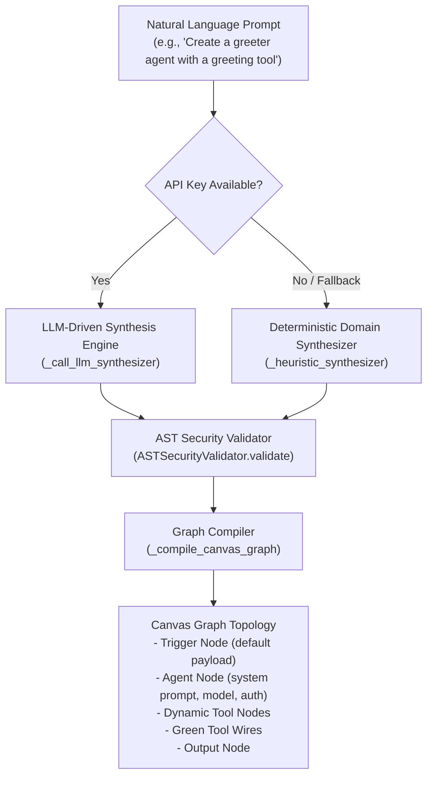

# Master Agent & Prompt-Driven Studio

The **Master Agent & Autonomous Synthesis Engine** (`src/litellm_adk/agent/manager.py`) translates plain-English instructions into production-ready agents, discovers reusable tools, generates secure Dynamic Tools (Python code + JSON Schema), and compiles them into visual React Flow canvas topology via the Graph Patch Protocol.

---

## 1. Architecture Overview



---

## 2. Industry-Standard Agent Naming (`_derive_agent_name_and_role`)

To comply with software engineering naming standards and avoid repeating user command verbs, the synthesis engine sanitizes prompt text:
- **Filters Imperative Action Verbs**: Strips `Create`, `Make`, `Build`, `Generate`, `Setup`, `Design`, `An`, `A`, `The`.
- **Deduplicates Suffixes**: Eliminates repeated suffixes like `AgentAgent` or `AssistantBot`.
- **Domain Normalization**: Converts phrases like `"greater agent"` or `"greeter"` into clean PascalCase identifiers like `GreeterAgent` or `GreetingAssistant`.

---

## 3. Targeted Domain Tool Synthesis

The deterministic synthesizer recognizes primary functional domains and synthesizes purpose-built Dynamic Tools:

| Domain Keywords | Agent Name | Dynamic Tool Generated | Schema Parameters |
|---|---|---|---|
| `greet`, `greeting`, `welcome`, `salutation` | `GreeterAgent` | `generate_greeting` | `user_name` (string), `tone` (enum), `time_of_day` (enum), `language` (string) |
| `postgres`, `database`, `sql`, `orders` | `DatabaseQueryAgent` | `query_customer_database` | `query_type` (orders, customer_profile), `identifier` (string) |
| `chart`, `metric`, `report`, `analytics` | `AnalyticsReportingAgent` | `generate_metric_report` | `metric_name` (string), `values` (array) |
| `email`, `mail`, `notify`, `alert` | `NotificationDispatchAgent` | `send_email_notification` | `recipient` (string), `subject` (string), `body` (string), `urgency` (enum) |
| `search`, `web`, `browse`, `news` | `WebResearchAgent` | Prebuilt `web_search_tool` | `max_results` (integer) |
| `calc`, `math`, `compute`, `formula` | `CalculatorAgent` | Prebuilt `calculator_tool` | `expression` (string) |
| *Custom Tool Request* (`with <name> tool`) | `<name>Agent` | `<name>_tool` | `input_data` (string) |

---

## 4. Canvas Graph Compilation (`_compile_canvas_graph`)

The synthesis engine outputs a React Flow graph ready to render on the canvas:

1. **Manual Trigger Node (`manual_trigger`)**: Pre-populated with realistic domain test payload (e.g. `{"user_name": "Alice", "tone": "friendly", "time_of_day": "morning"}`).
2. **AI Agent Node (`agent`)**: Configured with the synthesized agent's name, system prompt, and actionable prompt template (e.g. `"Generate a personalized welcome greeting for {{ trigger_1.user_name }} using your greeting tool."`).
3. **Dynamic Tool Nodes (`dynamic_tool`)**: Holds tool name, description, parameters, and sandboxed Python code.
4. **Tool Wiring**: Connects dynamic tool outputs (`[🧩 Tool Out]`) to the agent's tool socket (`[🧩 Tools In]`) with emerald green wires.
5. **Output Node (`output`)**: Captures `{{ agent.output }}` for final response rendering.

---

## 5. REST API Control Plane

The Master Agent exposes the following endpoints under `/api/v1/manager`:

### `GET /api/v1/manager/status`
Returns Master Agent configuration state:
```json
{
  "ready": true,
  "model": "gpt-4o",
  "has_key": true,
  "api_base": null
}
```

### `POST /api/v1/manager/configure`
Configures Master Agent model, API key, and base URL:
```json
{
  "model": "gpt-4o",
  "api_key": "sk-...",
  "api_base": "http://localhost:9000/v1"
}
```

### `POST /api/v1/manager/synthesize`
Transforms natural language prompt into full agent specifications and canvas graph:
```json
{
  "prompt": "Create greater agent with greeting tool"
}
```

### `POST /api/v1/manager/tools/test`
Executes Python code in the safe sandbox with test parameters and returns JSON output:
```json
{
  "code": "def run(name: str):\n    return {'hello': name}",
  "arguments": {"name": "Alice"},
  "timeout_seconds": 5.0
}
```

### `GET /api/v1/manager/templates`
Returns curated prompt templates (Customer Support, Financial Analyst, DevOps Security).
