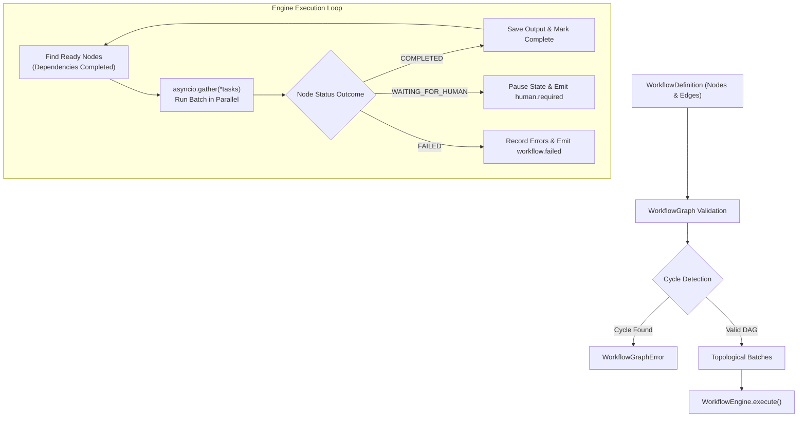

# Workflow Orchestration Engine

The **Workflow Orchestration Engine** (`src/litellm_adk/workflow/`) is a high-performance, asynchronous Directed Acyclic Graph (DAG) runtime. It executes multi-node agentic pipelines with concurrent node scheduling, expression evaluation, human-in-the-loop pause/resume, and real-time WebSocket event streaming.

---

## 1. Architecture & Execution Model



---

## 2. Declarative Graph Schema

Workflows are declared using three core Pydantic models:

```python
from litellm_adk.workflow.schema import WorkflowDefinition, WorkflowNode, WorkflowEdge

workflow = WorkflowDefinition(
    id="wf_customer_triage",
    name="Customer Triage Pipeline",
    version="1.0.0",
    nodes=[
        WorkflowNode(id="trig", type="manual_trigger", config={"default_payload": {"ticket_id": "TCK-102"}}),
        WorkflowNode(id="agent", type="agent", config={"model": "gpt-4o", "prompt": "Process {{ trig.ticket_id }}"}),
        WorkflowNode(id="out", type="output", config={"response": "{{ agent.output }}"}),
    ],
    edges=[
        WorkflowEdge(id="e1", source="trig", target="agent"),
        WorkflowEdge(id="e2", source="agent", target="out"),
    ],
)
```

---

## 3. DAG Compilation & Cycle Detection (`WorkflowGraph`)

Before execution, `WorkflowGraph` validates the workflow:
- **Topological Sorting**: Uses Kahn's algorithm to partition the graph into concurrent execution batches.
- **Cycle Detection**: Detects circular dependencies and raises `WorkflowGraphError`.
- **Target / Source Mapping**: Indexes edges by target and source handles for $O(1)$ lookup during execution.

---

## 4. Execution State & Status Lifecycle

The engine tracks execution through `ExecutionState`:

```python
class ExecutionStatus(str, Enum):
    PENDING = "pending"
    RUNNING = "running"
    WAITING_FOR_HUMAN = "waiting_for_human"
    COMPLETED = "completed"
    FAILED = "failed"
    CANCELLED = "cancelled"
```

### State Properties
- `execution_id`: Unique identifier for the execution run.
- `completed_nodes`: List of completed node IDs.
- `node_outputs`: Map of `node_id -> output_data`.
- `node_records`: Audit trail containing start time, end time, duration, input data, and tool calls for every node.
- `pending_approval`: Payload when execution is paused for human authorization.

---

## 5. Expression Evaluation & Templating

Node configurations support dynamic expressions resolved from upstream nodes:

```json
{
  "prompt": "Summarize inquiry: {{ trigger_1.query }} for customer {{ trigger_1.user_name }}",
  "response": "{{ agent_1.output }}"
}
```

The template engine resolves:
- `{{ trigger.<key> }}`: Data passed at workflow initiation.
- `{{ <node_id>.output }}`: Direct output produced by an upstream node.
- `{{ variables.<var_name> }}`: Global workflow variables.

---

## 6. Real-Time WebSocket Streaming

The engine broadcasts execution milestones over WebSockets via `EventBus`:

| Event Type | Payload Fields | Description |
|---|---|---|
| `workflow.started` | `execution_id`, `workflow_id` | Fired when graph execution begins. |
| `node.started` | `node_id`, `node_type`, `node_name` | Fired when a node begins execution. |
| `node.completed` | `node_id`, `output`, `duration` | Fired when a node finishes successfully. |
| `node.failed` | `node_id`, `error` | Fired when a node throws an exception. |
| `human.required` | `node_id`, `approval` | Fired when human decision is required. |
| `workflow.completed` | `execution_id`, `duration`, `outputs` | Fired when all nodes finish successfully. |
