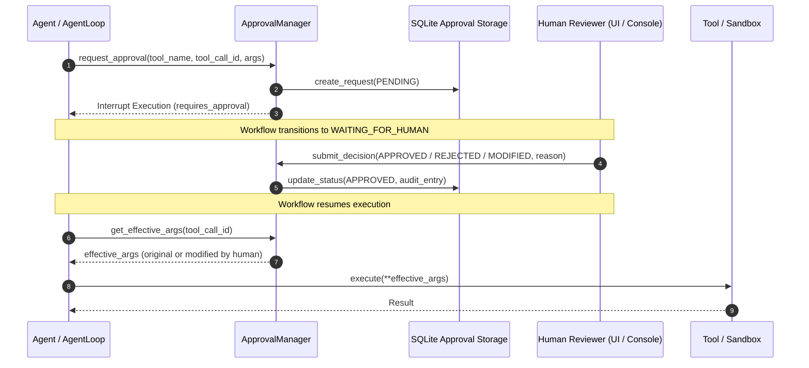

# Human-in-the-Loop & Approval Systems

Autonomous AI agents operating in enterprise environments require strict safety guardrails. The LiteLLM ADK provides a robust **Human-in-the-Loop (HITL)** framework (`src/litellm_adk/human/`) to pause execution, request human sign-off, audit actions, and allow operators to modify arguments before tools are executed.

---

## 1. Approval Architecture & Intercept Cycle



---

## 2. Flagging Tools for Human Approval

Tools can require approval statically via boolean or dynamically via callable rules:

```python
from litellm_adk.tools import tool, ToolPermission

# 1. Static approval required
@tool(
    name="delete_database_cluster",
    description="Deletes a production database cluster.",
    permissions={ToolPermission.DANGEROUS},
    requires_approval=True,
)
def delete_database_cluster(cluster_id: str) -> dict:
    return {"status": "deleted", "cluster_id": cluster_id}

# 2. Dynamic conditional approval based on transaction value
@tool(
    name="transfer_funds",
    description="Transfers funds between accounts.",
    requires_approval=lambda args: args.get("amount", 0) > 10000.0,
)
def transfer_funds(account_id: str, amount: float) -> dict:
    return {"status": "transferred", "amount": amount}
```

---

## 3. Storage Backends (`ApprovalManager`)

### 1. In-Memory Approval Manager (`InMemoryApprovalManager`)
Suitable for single-node prototypes and automated tests:
```python
from litellm_adk.human import InMemoryApprovalManager

approval_mgr = InMemoryApprovalManager()
```

### 2. SQLite Approval Manager (`SQLiteApprovalManager`)
Persistent storage with complete audit history and resumption capabilities across server restarts:
```python
from litellm_adk.human import SQLiteApprovalManager

approval_mgr = SQLiteApprovalManager(db_path="workflows.db")

agent = Agent(
    model="gpt-4o",
    approval_manager=approval_mgr,
)
```

---

## 4. Submitting Reviewer Decisions

Reviewers can approve, reject, or modify arguments before dispatch:

```python
from litellm_adk.models import ApprovalStatus

# Approve as-is
approval_mgr.submit_decision(
    id="call_abc123",
    status=ApprovalStatus.APPROVED,
    reviewer="security_officer_jane",
    reason="Verified legitimate maintenance window.",
)

# Reject with reason (notifies the agent loop to self-correct)
approval_mgr.submit_decision(
    id="call_def456",
    status=ApprovalStatus.REJECTED,
    reviewer="security_officer_jane",
    reason="Destination account is under sanctions review.",
)

# Modify arguments (e.g. reduce transfer amount to allowed limit)
approval_mgr.submit_decision(
    id="call_ghi789",
    status=ApprovalStatus.MODIFIED,
    reviewer="compliance_team",
    modified_args={"account_id": "ACC-99", "amount": 5000.0},
    reason="Lowered amount to maximum authorized limit.",
)
```

---

## 5. Control Plane REST API for Approvals

The visual studio client and external webhooks submit decisions via:

```http
POST /api/v1/executions/{execution_id}/approve
Content-Type: application/json

{
  "approved": true,
  "user_input": "Approved for execution.",
  "selected_option": "approve"
}
```
