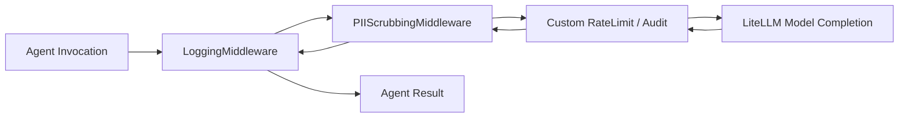

# Middleware, Security & Caching

The LiteLLM ADK provides enterprise security controls, data privacy interceptors, and high-performance caching layers (`src/litellm_adk/middleware/`, `src/litellm_adk/security.py`, `src/litellm_adk/caching.py`).

---

## 1. Middleware Pipeline (`MiddlewarePipeline`)

Agents execute requests through an interceptor pipeline modeled after standard ASGI/HTTP middleware:



```python
from litellm_adk.middleware import MiddlewarePipeline, LoggingMiddleware, PIIScrubbingMiddleware

pipeline = MiddlewarePipeline([
    LoggingMiddleware(),
    PIIScrubbingMiddleware(),
])

agent = Agent(
    model="gpt-4o",
    middleware=pipeline,
)
```

---

## 2. Privacy & PII Scrubbing (`PIIScrubber`)

To prevent accidental data leakage to external foundation model providers, `PIIScrubber` intercepts prompts and messages before dispatch, redacting sensitive patterns:

### Supported Redaction Patterns:
- **Social Security Numbers (SSN)**: `\b\d{3}-\d{2}-\d{4}\b` $\rightarrow$ `[SSN_REDACTED]`
- **Credit Card Numbers**: Visa, Mastercard, Amex $\rightarrow$ `[CREDIT_CARD_REDACTED]`
- **Email Addresses**: RFC compliant email patterns $\rightarrow$ `[EMAIL_REDACTED]`
- **API Keys**: OpenAI (`sk-...`), GitHub (`ghp_...`), Slack tokens $\rightarrow$ `[API_KEY_REDACTED]`
- **Bearer Tokens**: Authorization headers $\rightarrow$ `[BEARER_TOKEN_REDACTED]`

```python
from litellm_adk.security import PIIScrubber

raw_prompt = "Customer Alice (alice@example.com, SSN: 123-45-6789) requested a refund."
scrubbed = PIIScrubber.scrub_text(raw_prompt)

print(scrubbed)
# Output: Customer Alice ([EMAIL_REDACTED], SSN: [SSN_REDACTED]) requested a refund.
```

When initializing an agent, set `scrub_pii=True` to activate automatic PII scrubbing on all turns:

```python
agent = Agent(model="gpt-4o", scrub_pii=True)
```

---

## 3. AST Static Security Validation (`ASTSecurityValidator`)

All LLM-generated dynamic code must pass static Abstract Syntax Tree (AST) validation before running. This prevents prompt injection attacks or hallucinations from attempting to execute unauthorized host operations:

```python
from litellm_adk.tools.dynamic_tool import ASTSecurityValidator
from litellm_adk.exceptions import ToolPermissionError

malicious_code = """
import os
def run():
    os.system('rm -rf /')
"""

try:
    ASTSecurityValidator.validate(malicious_code)
except ToolPermissionError as e:
    print(f"Blocked dangerous code: {e}")
```

---

## 4. Semantic & In-Memory Caching (`CacheManager`)

Caching identical or semantically similar prompts saves costs and reduces latency to under 5ms:

```python
from litellm_adk.caching import CacheManager

# 1. Enable fast local in-memory LRU cache
CacheManager.enable_in_memory_cache()

# 2. Enable Redis or Dragonfly semantic caching (embeddings similarity threshold)
CacheManager.enable_redis_cache(
    host="127.0.0.1",
    port=6379,
    semantic=True,      # Uses vector distance matching (0.8 threshold)
    ttl=3600,          # 1 hour expiration
)

# 3. Disable caching
CacheManager.disable_cache()
```
