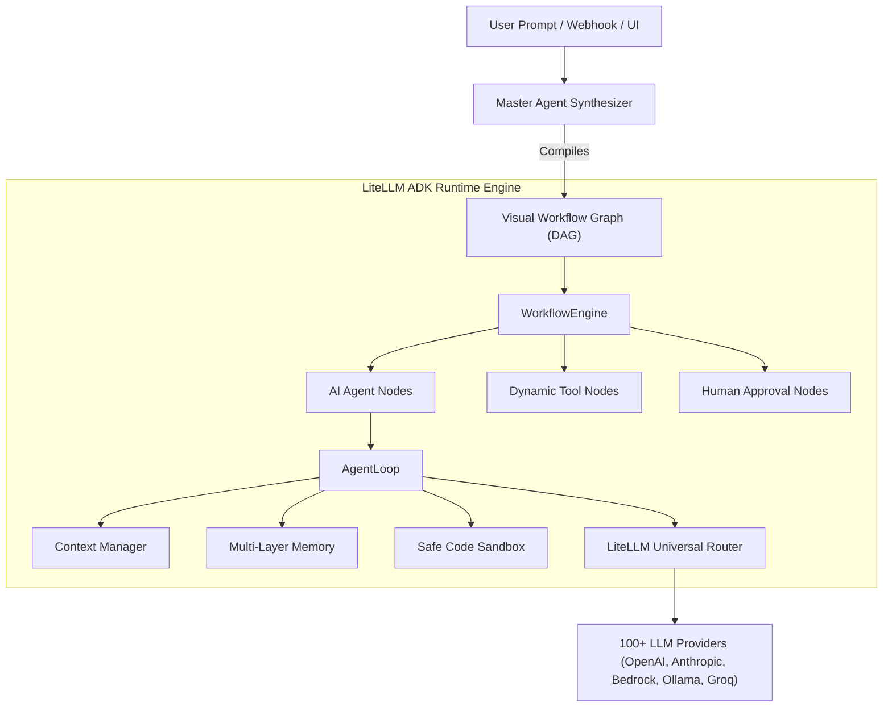

# LiteLLM ADK Documentation

Welcome to the official documentation for the **LiteLLM Agent Development Kit (ADK)** — a production-ready, enterprise-grade autonomous agent and visual workflow platform built on top of [LiteLLM](https://github.com/BerriAI/litellm).

---

## 📚 Documentation Index

| Guide | Description |
|---|---|
| [**1. Architecture Overview**](./01-architecture-overview.md) | High-level system architecture, core topology, design principles, and component interaction. |
| [**2. Getting Started**](./02-getting-started.md) | Installation, environment setup, quick-start guide, and running your first agent. |
| [**3. Agent Framework & Core Loop**](./03-agent-framework.md) | Core `Agent`, `AgentLoop`, multi-turn reasoning, lifecycle states, and declarative execution configuration. |
| [**4. Tools & Dynamic Tooling**](./04-tools-and-dynamic-tooling.md) | Standard tools, `DynamicToolSpec`, AST security validator, safe code sandbox, MCP tools, and registry. |
| [**5. Master Agent & Prompt-Driven Studio**](./05-master-agent-synthesis.md) | Autonomous prompt-to-agent compiler, domain tool generation, heuristic & LLM synthesizers, and canvas graph generation. |
| [**6. Workflow Orchestration Engine**](./06-workflow-orchestration-engine.md) | DAG graph compiler, topological scheduling, concurrent execution, state management, and WebSocket streaming. |
| [**7. Workflow Nodes Reference**](./07-workflow-nodes-reference.md) | Detailed catalog of all visual nodes (`agent`, `manual_trigger`, `webhook_trigger`, `dynamic_tool`, `condition`, `transform`, `human`, `output`). |
| [**8. Memory & Context Management**](./08-memory-context-management.md) | Multi-layer memory architecture, storage backends (SQLite, Mongo, Vector), and `ContextManager` sliding window compaction. |
| [**9. Human-in-the-Loop & Approvals**](./09-human-in-the-loop-and-approvals.md) | Safety policies, `ApprovalManager`, sensitive tool intercepts, and asynchronous decision resolution. |
| [**10. Multi-Agent Orchestration & Handoffs**](./10-multi-agent-orchestration.md) | `AgentTeam`, `Supervisor`, hierarchical agents, and dynamic tool handoff protocols. |
| [**11. Middleware, Security & Caching**](./11-middleware-security-caching.md) | PII masking, semantic caching, token tracking, and AST security sandbox guardrails. |
| [**12. REST API & Server Reference**](./12-api-and-server-reference.md) | FastAPI control plane, execution endpoints, WebSocket streaming protocol, and deployment guide. |

---

## 🚀 Key Architectural Pillars

1. **Universal LLM Compatibility**: Seamlessly interface with 100+ LLMs using unified LiteLLM routing, fallbacks, and retry policies.
2. **Autonomous Prompt-to-Agent Creation**: Transform plain English instructions into typed agents with custom Python tools and visual canvas wiring.
3. **AST-Validated Dynamic Tooling**: Synthesize and execute dynamic Python tools safely in an isolated AST-verified runtime.
4. **Resilient Graph Execution**: Non-blocking DAG execution with full pause/resume capabilities for human approvals.
5. **Multi-Turn Memory & RAG**: Pluggable storage with working memory, conversation history, and vector retrieval.
