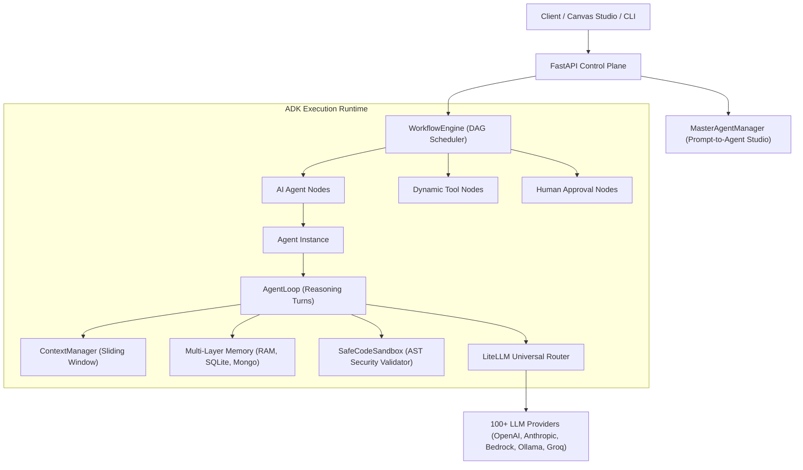

# Architecture Overview

The **LiteLLM ADK** (Agent Development Kit) is an enterprise-grade agentic operating framework built on top of [LiteLLM](https://github.com/BerriAI/litellm). It decouples autonomous agent reasoning, dynamic tool creation, and graph workflow orchestration from proprietary vendor APIs.

For the comprehensive in-depth architecture document, see [**01. Architecture Overview**](./01-architecture-overview.md).

---

## 1. High-Level Topology

---

## 2. Core Subsystems

1. **Agent Engine (`src/litellm_adk/agent/`)**: Multi-turn reasoning loops, declarative configs, tool calling, and Pydantic structured output parsing. See [Agent Framework & Core Loop](./03-agent-framework.md).
2. **Tools & Dynamic Tooling (`src/litellm_adk/tools/`)**: Typed tool decorators, `DynamicToolSpec`, AST security validator, and restricted code sandbox execution. See [Tools & Dynamic Tooling](./04-tools-and-dynamic-tooling.md).
3. **Master Agent (`src/litellm_adk/agent/manager.py`)**: Autonomous prompt-to-agent compiler translating natural language instructions into canvas graphs. See [Master Agent & Prompt-Driven Studio](./05-master-agent-synthesis.md).
4. **Workflow Engine (`src/litellm_adk/workflow/`)**: Asynchronous DAG scheduler with cycle detection, topological batch sorting, and live WebSocket streaming. See [Workflow Orchestration Engine](./06-workflow-orchestration-engine.md).
5. **Memory & Context (`src/litellm_adk/memory/`, `src/litellm_adk/context/`)**: Multi-layer memory backends and sliding-window context compaction. See [Memory & Context Management](./08-memory-context-management.md).
6. **Human-in-the-Loop (`src/litellm_adk/human/`)**: Sensitive action gating, approval audit logging, and asynchronous resumption. See [Human-in-the-Loop & Approvals](./09-human-in-the-loop-and-approvals.md).
7. **Control Plane Server (`src/litellm_adk/server/`)**: FastAPI REST endpoints and real-time event streaming. See [REST API & Server Reference](./12-api-and-server-reference.md).
