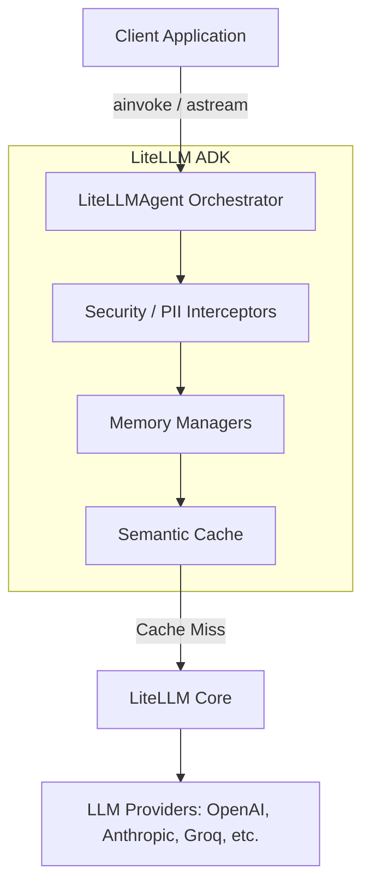

# Architecture Overview

The LiteLLM ADK is designed as an orchestration layer that sits directly on top of the `litellm` library. Its primary purpose is to decouple business logic from provider-specific implementations while adding enterprise-grade resiliency.

## High-Level Topology

## Core Components

### 1. The Orchestrator (`LiteLLMAgent`)
The central node of the framework. It handles the lifecycle of a request:
1. Receives the raw prompt.
2. Retrieves past conversational context from the Memory backend.
3. Passes the payload through Security Interceptors (e.g., stripping internal metadata, masking PII).
4. Forwards the payload to the LiteLLM routing layer.
5. Handles tool execution and Human-in-the-Loop authorization.

### 2. State & Memory Adapters
Unlike raw API calls, the ADK maintains state natively. The `BaseMemory` interface allows you to plug in different storage architectures based on your scaling needs:
- `InMemoryMemory`: Fast, volatile storage for single-node prototypes.
- `MongoMemory`: Persistent, horizontally scalable storage for production clusters.
- `SQLMemory`: Relational storage leveraging SQLAlchemy.

### 3. Execution Guardrails
When an agent attempts to execute a registered tool, the framework intercepts the execution. If the tool is flagged as sensitive, the ADK halts the internal event loop and bubbles an authorization request back up to the client application, ensuring that AI-driven operations cannot mutate infrastructure without explicit permission.
